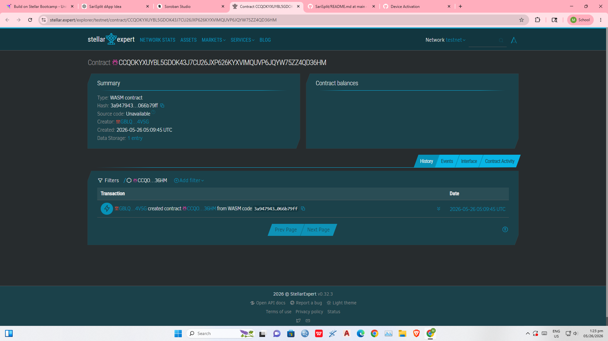

# SariSplit

Instant community bill splitting on Stellar.

## Contract deployment
contract id: CCQOKYXUYBL5GDOK43J7CU26JXP626KYXVIMQUVP6JQYW75ZZ4QD36HM



## Problem

Jeepney drivers and neighborhood organizers in Metro Manila lose money because passengers and buyers forget to send their split payments.

## Solution

Passengers contribute USDC into a Soroban-powered payment pool that automatically releases funds once the target amount is reached.

## Timeline

- Week 1: Smart contract
- Week 2: Frontend integration
- Week 3: Testnet deployment
- Week 4: Demo polish

## Stellar Features Used

- USDC transfers
- Soroban smart contracts
- Trustlines

## Vision and Purpose

Enable instant micro-settlement for everyday shared expenses in low-income communities.

## Prerequisites

- Rust stable
- Soroban CLI v22

## Build

```bash


